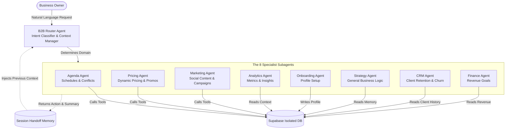

# Daily AI Core: Enterprise Vertical IAaaS & Agentic Commerce Engine

This repository showcases the isolated **AI Core Logic** of **Daily**, a highly scalable, dedicated **Vertical AI SaaS (IAaaS)** platform. Powered by **Google Gemini 2.5 Flash** and **Supabase**, this architecture represents the state-of-the-art in Enterprise Agentic Systems.

---

## 🎯 The Vision: Democratizing AI Usage, Not Just Price

The true barrier to AI adoption in small and medium businesses isn't just the subscription cost—it's the **cognitive load**. Business owners are not "Prompt Engineers". They don't have the time to learn how to perfectly craft instructions, define system parameters, or chain LLM logic.

**Our Mission:** Democratize AI *Usage*.
With Daily, a business owner simply says: *"I want to run a 20% off haircut promotion this Friday."*
Behind the scenes, our **8-Subagent Architecture** automatically dissects this natural language intent, defines all necessary parameters, triggers the Marketing Agent to draft the post, triggers the Pricing Agent to apply the discount, and triggers the Agenda Agent to block out the slots. **Zero prompt engineering required from the user.** The AI acts as a fully autonomous digital operating system.

---

## 🏢 Business Model: Dedicated Enterprise IAaaS & Vertical Templates

Daily is **not** a generic multi-tenant chatbot where 10,000 businesses share the same database and risk exposing their sensitive data. Our architecture is designed for **High-Ticket B2B Enterprise & White-Label Franchising**.

We operate on a **Vertical AI Template** model:
1. **Industry-Specific Brains**: We build pre-configured "Vertical Templates" (e.g., *Daily Health* for Clinics, *Daily Food* for Restaurants, *Daily Services* for Salons). Each template contains a highly specialized Database Schema, finely-tuned Agent Contexts, and proprietary Functions.
2. **Dedicated Instances (Single-Tenant Security)**: When a new client or franchise onboards, we clone the Vertical Template. They receive their own **100% isolated database** and a dedicated AI instance. 
3. **White-Labeling**: The interface is customized to their brand.

This grants the **speed** of a generic SaaS with the **military-grade data security and extreme customization** of a dedicated Enterprise software. We can charge a premium for the guaranteed privacy, while scaling infinitely.

---

## 🏛️ Ecosystem Overview: 8-Subagent Architecture

> **Note**: This is a read-only architectural showcase, decoupled from the main application. Files under `lib/ai/` that reference `@/lib/supabase` assume the Supabase client configuration from the main Daily repository and are not intended to run standalone here.

The AI ecosystem relies on a sophisticated **Router + 8 Specialists** paradigm. This drastically reduces token consumption, eliminates hallucination risks by isolating context, and provides highly specialized memory scopes per domain.



### 🧠 The 8 Specialist Agents
1. **Agenda Agent**: Manages booking slots, cancellations, and availability (reads `appointments`).
2. **Pricing Agent**: Competitor analysis, dynamic discounts, and service configuration.
3. **Marketing Agent**: Crafts Instagram captions, Whatsapp broadcast messages, and content calendars.
4. **Analytics Agent**: Reads engagement metrics and page views from the storefront.
5. **Onboarding Agent**: Proactively identifies missing profile info and forces setup completion.
6. **Strategy Agent**: Handles long-term planning, Q&A, and general business advice.
7. **CRM Agent**: Segments clients (Active, At Risk, Churned) based on visit history.
8. **Finance Agent**: Tracks revenue against monthly targets (reads `revenue_goals`).

---

## 📁 Repository Structure

```text
delta-ia-daily/
├── README.md                        # Enterprise Architecture Documentation
├── docs/                            # Extensive Project Documentation
├── lib/
│   ├── ai/                          # 8-Subagent Core Logic
│   │   ├── router.ts                # Main intent classifier and routing orchestrator
│   │   ├── session-context.ts       # Handoff memory manager between turns
│   │   ├── types.ts                 # Type definitions for the 8 Subagents
│   │   ├── agents/                  # The 8 individual Subagents
│   │   ├── contexts/                # Isolated Context Builders (SQL data fetchers)
│   │   ├── prompts/                 # Specialized Prompts for each Agent persona
│   │   └── tools/                   # Isolated function tools (SQL mutations)
│   ├── intent-classifier.ts         # Multi-word Local Intent Parser (Latency & Cost Optimization)
│   ├── ai.ts                        # Gemini LLM Initialization & Multi-Agent Configurations
│   └── ai-tools.ts                  # Legacy monolithic tools
├── database-schema/
│   ├── 20260517050000_ai_context_fields.sql # Supabase Migration for Context memory
│   ├── ai_logs_setup.sql            # Table structure for AI observability and usage logs
│   ├── init_ai_schema.sql           # PostgreSQL Schema: 3-Layer Memory, Audit Logs, and RLS
│   └── rpc_get_week_availability.sql # Postgres function for retrieving availability
├── hooks/
│   ├── use-ai-chat.ts               # B2B Merchant Agent Frontend Hook
│   └── use-consumer-ai-chat.ts      # B2C Consumer Agent Frontend Hook
├── supabase-edge-functions/
│   ├── gemini-chat/                 # Secure Server-Side API Handshake & Token Management
│   ├── daily-briefing/              # Autonomous Business Analytics Aggregator
│   └── notify-booking/              # Real-Time Transactional Webhooks
└── ui-components/
    ├── ai-chat.tsx                  # B2B Conversational Interface Core
    └── consumer-ai-chat/            # B2C Frictionless Checkout & Booking Interface
```

---

## 🔒 Security & Extensibility
By fully decoupling the LLM context from generic multi-tenant logic, the Daily Architecture ensures **Zero-Data Leakage** between clients. Every function execution and context builder strictly filters by the instantiated professional ID (`seller_id`, `professional_id`). This makes the architecture robust enough to handle HIPAA-compliant health data or highly confidential enterprise financial data.
