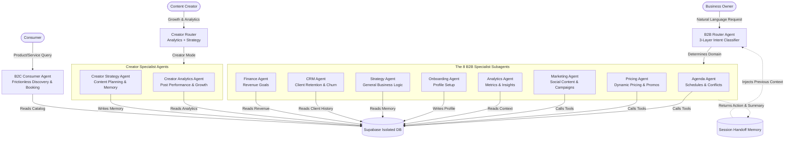

# Daily AI Core: Enterprise Vertical IAaaS & Agentic Commerce Engine

This repository contains the isolated **AI Core Logic** of **Daily**, a highly scalable, dedicated **Vertical AI SaaS (IAaaS)** platform. Powered by **Google Gemini 2.5 Flash** and **Supabase**, this architecture represents the state-of-the-art in Enterprise Agentic Systems.

> **Daily is just the beginning.** The AI engine powering this app is designed to be **cloned, customized, and deployed** across any vertical — from beauty salons to clinics, restaurants to law firms. This repository is the blueprint for an **AI Operating System for Commerce**.

---

## 🎯 The Vision: Democratizing AI Usage, Not Just Price

The true barrier to AI adoption in small and medium businesses isn't the subscription cost — it's the **cognitive load**. Business owners are not "Prompt Engineers". They don't have time to learn how to craft instructions, define system parameters, or chain LLM logic.

**Our Mission:** Democratize AI *Usage*.

With Daily, a business owner simply says: *"I want to run a 20% off haircut promotion this Friday."*

Behind the scenes, our **Multi-Agent Architecture** automatically dissects this natural language intent, defines all necessary parameters, triggers the Marketing Agent to draft the post, triggers the Pricing Agent to apply the discount, and triggers the Agenda Agent to block out the slots. **Zero prompt engineering required from the user.** The AI acts as a fully autonomous digital operating system.

---

## 🏢 Business Model: IAaaS — AI Infrastructure as a Service

Daily is **not** a generic multi-tenant chatbot where 10,000 businesses share the same database and risk exposing their sensitive data. Our architecture is designed for **High-Ticket B2B Enterprise & White-Label Franchising**.

We operate on a **Vertical AI Template** model:

1. **Industry-Specific Brains**: Pre-configured "Vertical Templates" (e.g., *Daily Health* for Clinics, *Daily Food* for Restaurants, *Daily Services* for Salons). Each template contains a highly specialized Database Schema, finely-tuned Agent Contexts, and proprietary Functions.
2. **Dedicated Instances (Single-Tenant Security)**: When a new client or franchise onboards, we clone the Vertical Template. They receive their own **100% isolated database** and a dedicated AI instance.
3. **White-Labeling**: The interface is customized to their brand.

This grants the **speed** of a generic SaaS with the **military-grade data security and extreme customization** of a dedicated Enterprise software.

### 🔄 IAaaS Scalability Model

```text
                    ┌─────────────────────────────────┐
                    │       DAILY AI CORE ENGINE       │
                    │   (This Repository)              │
                    │                                  │
                    │   Router · Agents · Memory       │
                    │   Tools · Edge Functions · RLS   │
                    └──────────────┬──────────────────┘
                                   │
               ┌───────────────────┼───────────────────┐
               │                   │                   │
               ▼                   ▼                   ▼
      ┌────────────────┐  ┌────────────────┐  ┌────────────────┐
      │  💇 Daily       │  │  🏥 Daily       │  │  🍔 Daily       │
      │  Beauty         │  │  Health         │  │  Food           │
      │                 │  │                 │  │                 │
      │  Salon-tuned    │  │  Clinic-tuned   │  │  Menu-tuned     │
      │  prompts + DB   │  │  prompts + DB   │  │  prompts + DB   │
      │  + AI Memory    │  │  + AI Memory    │  │  + AI Memory    │
      └────────────────┘  └────────────────┘  └────────────────┘
               │                   │                   │
               ▼                   ▼                   ▼
         100% Isolated       100% Isolated       100% Isolated
         Database            Database             Database
```

Each deployment = dedicated database + dedicated AI brain + dedicated memory. **Zero cross-tenant data leakage.**

---

## 🏛️ Ecosystem Overview: Dual-AI Multi-Agent Architecture

> **Note**: This is a read-only architectural showcase, decoupled from the main application. Files under `lib/ai/` that reference `@/lib/supabase` assume the Supabase client configuration from the main Daily repository and are not intended to run standalone here.

The AI ecosystem relies on a sophisticated **Router + Specialists** paradigm with two distinct AI personas. This drastically reduces token consumption, eliminates hallucination risks by isolating context, and provides highly specialized memory scopes per domain.



### 🧠 The 8 B2B Specialist Agents

| # | Agent | Domain | Key Tools |
|---|-------|--------|-----------|
| 1 | **Agenda Agent** | Booking slots, cancellations, availability | `appointment.tools.ts` |
| 2 | **Pricing Agent** | Competitor analysis, dynamic discounts, service config | `pricing.tools.ts` |
| 3 | **Marketing Agent** | Instagram captions, WhatsApp broadcasts, content calendars | `content.tools.ts` |
| 4 | **Analytics Agent** | Engagement metrics, page views, storefront insights | `analytics.tools.ts` |
| 5 | **Onboarding Agent** | Missing profile detection, setup completion | — (context-driven) |
| 6 | **Strategy Agent** | Long-term planning, Q&A, general business advice | `memory.tools.ts` |
| 7 | **CRM Agent** | Client segments (Active, At Risk, Churned) | `crm.tools.ts` |
| 8 | **Finance Agent** | Revenue tracking, monthly targets | `finance.tools.ts` |

### 🎨 Creator Agents

For users with `profile_type === 'creator'`, the Router activates a separate pipeline with specialized agents:

| Agent | Domain | Key Tools |
|-------|--------|-----------|
| **Creator Analytics Agent** | Post performance, best posting times, engagement metrics | `creator-analytics.tools.ts` |
| **Creator Strategy Agent** | Content planning, growth advice, long-term memory | `creator-analytics.tools.ts` + `save_memory` |

The Creator pipeline uses its own **3-layer classification**: local regex → keyword intent → Gemini with creator-specific context.

### 🛍️ Consumer AI (B2C — Delta do Daily)

The **Consumer Agent** is a separate AI pipeline designed for end-users:
- Natural language product/service discovery
- One-tap booking from chat
- Intent classification without LLM (`consumer-intent-classifier.ts` — local keyword parser for speed)
- Recurring client memory (personalized experience for returning customers)
- Frictionless checkout flow integrated in the chat UI

---

## 📁 Repository Structure

```text
delta-ia-daily/
├── README.md
├── tsconfig.json
│
├── lib/
│   ├── ai/                                  # Multi-Agent Core Logic
│   │   ├── router.ts                        # 3-Layer intent classifier & routing orchestrator
│   │   ├── session-context.ts               # Handoff memory manager between turns
│   │   ├── types.ts                         # Type definitions for all agents
│   │   ├── index.ts                         # AI module exports
│   │   │
│   │   ├── agents/                          # Specialist Agents
│   │   │   ├── base.agent.ts                # Shared execution engine (Gemini + Tool Call loop)
│   │   │   ├── agenda.agent.ts              # Booking & scheduling
│   │   │   ├── analytics.agent.ts           # Metrics & insights
│   │   │   ├── crm.agent.ts                 # Client retention
│   │   │   ├── finance.agent.ts             # Revenue tracking
│   │   │   ├── marketing.agent.ts           # Content generation
│   │   │   ├── onboarding.agent.ts          # Profile setup
│   │   │   ├── pricing.agent.ts             # Dynamic pricing
│   │   │   └── strategy.agent.ts            # Business strategy
│   │   │
│   │   ├── contexts/                        # Isolated Context Builders (SQL data fetchers)
│   │   │   ├── shared-utils.ts              # Shared query utilities
│   │   │   ├── router.context.ts            # Router-level context
│   │   │   ├── creator.context.ts           # Creator profile & post data
│   │   │   ├── agenda.context.ts            # Appointment data
│   │   │   ├── analytics.context.ts         # Metrics data
│   │   │   ├── crm.context.ts               # Client history
│   │   │   ├── finance.context.ts           # Revenue data
│   │   │   ├── marketing.context.ts         # Content data
│   │   │   ├── onboarding.context.ts        # Profile completeness
│   │   │   ├── pricing.context.ts           # Service pricing
│   │   │   └── strategy.context.ts          # Business data
│   │   │
│   │   ├── prompts/                         # Specialized system prompts per Agent
│   │   │   ├── router.prompt.ts             # Router classification prompt
│   │   │   ├── creator-analytics.prompt.ts  # Creator analytics persona
│   │   │   ├── creator-strategy.prompt.ts   # Creator strategy persona
│   │   │   ├── agenda.prompt.ts
│   │   │   ├── analytics.prompt.ts
│   │   │   ├── crm.prompt.ts
│   │   │   ├── finance.prompt.ts
│   │   │   ├── marketing.prompt.ts
│   │   │   ├── onboarding.prompt.ts
│   │   │   ├── pricing.prompt.ts
│   │   │   └── strategy.prompt.ts
│   │   │
│   │   └── tools/                           # Isolated function tools (SQL mutations)
│   │       ├── appointment.tools.ts         # Enhanced scheduling tools
│   │       ├── creator-analytics.tools.ts   # Creator post & growth analytics
│   │       ├── analytics.tools.ts
│   │       ├── content.tools.ts
│   │       ├── crm.tools.ts
│   │       ├── finance.tools.ts
│   │       ├── memory.tools.ts
│   │       └── pricing.tools.ts
│   │
│   ├── ai.ts                                # Gemini LLM init & multi-agent config
│   ├── intent-classifier.ts                 # B2B local intent parser (regex + negation scoring)
│   ├── logger.ts                             # Structured JSON logger (observability core)
│   └── supabase.ts                          # Supabase client config
│
├── hooks/                                   # React Native frontend hooks
│   ├── use-ai-chat.ts                       # B2B Merchant Agent hook (Router integration)
│   ├── use-consumer-ai-chat.ts              # B2C Consumer Agent hook (Delta pipeline)
│   ├── use-posts.ts                         # Post management hook
│   └── use-schedule.ts                      # Schedule management hook
│
├── ui-components/                           # Chat UI components
│   ├── ai-chat.tsx                          # B2B conversational interface
│   └── consumer-ai-chat/                    # B2C discovery & booking interface
│
├── database-schema/                         # Supabase migrations & SQL
│   ├── init_ai_schema.sql                   # Base schema: memory, audit, RLS
│   ├── 20260517050000_ai_context_fields.sql # Context memory fields
│   ├── 20260613_add_client_profile_link.sql # Client-profile linking
│   ├── 20260622_ai_atomic_rpc.sql           # Atomic RPCs (prevents race conditions)
│   ├── ai_logs_setup.sql                    # AI observability & usage logs
│   ├── rpc_get_week_availability.sql        # Postgres function: weekly availability
│   ├── fix_missing_columns.sql              # Schema patches
│   ├── seed_demo_account.sql                # Demo data for hackathon judges
│   └── cleanup_demo.sql                     # Demo data cleanup
│
├── supabase/functions/                      # Supabase Edge Functions (active)
│   ├── gemini-chat/                         # Secure server-side LLM gateway (Gemini)
│   ├── groq-chat/                           # High-speed LLM gateway (Groq LPU)
│   ├── daily-briefing/                      # Autonomous business analytics aggregator
│   ├── generate-image/                      # AI image generation
│   ├── inactivity-alert/                    # Proactive engagement notifications
│   └── notify-booking/                      # Real-time transactional webhooks
│
└── docs/                                    # Project documentation
    ├── daily-ai-enterprise-architecture.html # 🏛️ 10-section Enterprise Architecture Doc
    ├── architecture-diagram.html            # Interactive architecture visualization
    ├── business-vision.md                   # Business model & vision document
    ├── unit-economics.md                    # Unit economics & pricing analysis
    ├── roadmap.md                           # Development roadmap
    └── daily-future-vision.png              # Vision diagram
```

---

## ⚙️ Technical Highlights

### 3-Layer Router Intelligence

The `router.ts` classifies user intent using a progressive confidence-based pipeline that **saves ~73% of API costs**:

```text
Layer 1: Local Regex (intent-classifier.ts) → confidence ≥ 0.8 → dispatch (0 tokens, <1ms)
Layer 2: Gemini Flash Micro                 → confidence ≥ 0.4 → dispatch (~10 tokens)
Layer 3: Gemini Full (with 5-turn history)  → fallback          (~500 tokens)
```

Additional intelligence:
- **Session continuity**: Short replies ("sim", "ok", "pode") automatically reuse the last agent
- **Onboarding override**: New professionals are routed to Onboarding when intent is ambiguous
- **Creator routing**: `profile_type === 'creator'` activates a separate agent pipeline
- **Extra pattern matching**: Deep regex patterns for CRM, Finance, and Agenda domains

### Agent Isolation Pattern

Each agent operates with:
- **Own system prompt** (`prompts/`) — persona-tuned for the domain
- **Own context builder** (`contexts/`) — fetches only the SQL data it needs
- **Own tool set** (`tools/`) — can only mutate its own domain tables
- **Own memory scope** — agents don't see each other's context

This ensures **zero cross-contamination** between agents and drastically reduces token consumption.

### 6-Layer Memory Architecture

| Layer | Type | Storage | Purpose |
|-------|------|---------|---------|
| **Conversation** | Ephemeral | `useRef` (chatHistory[]) | Last 40 entries for multi-turn context |
| **Session** | Ephemeral | `SessionManager` class | Agent handoff, topic tracking |
| **Business** | Persistent | `ai_memories` table | Business facts, preferences (relevance-scored) |
| **Professional** | Persistent | `profiles` table | Specialty, bio, hours, services |
| **Client/Customer** | Persistent | `client_profiles` table | Visit history, churn detection |
| **Creator** | Persistent | `creator_memory` table | Strategy insights, content performance |

### Appointment System

The Agenda Agent uses `rpc_get_week_availability` — a Postgres function that computes available slots by cross-referencing:
- Professional's working hours
- Existing appointments
- Service duration
- Buffer time between appointments

### Edge Functions

| Function | Purpose | Trigger |
|----------|---------|---------|
| `gemini-chat` | Secure LLM gateway (Gemini) with atomic usage tracking | User message |
| `groq-chat` | High-speed LLM gateway (Groq LPU) | User message |
| `daily-briefing` | Aggregates daily business metrics autonomously | Cron / manual |
| `generate-image` | AI-powered image generation for marketing | Agent request |
| `inactivity-alert` | Proactive push when user hasn't engaged | Cron |
| `notify-booking` | Real-time booking confirmations | Database webhook |

### Atomic RPCs (Race Condition Prevention)

`increment_ai_usage()` and `increment_ai_image_usage()` use `ON CONFLICT ... DO UPDATE` with `SECURITY DEFINER` to prevent double-counting under concurrent load.

### 📊 Observability Engine (`logger.ts`)

Enterprise-grade structured logging built into every layer:

| Capability | Implementation | Example Output |
|------------|---------------|----------------|
| **Request ID** | `req_<timestamp>_<random>_<counter>` | `req_m4k7x_a3f2_42` |
| **Structured JSON** | All logs emit JSON, never free text | `{"level":"info","category":"ai.request",...}` |
| **Stack Traces** | Full `Error.stack` + user/agent/action context | Pinpoints exact failure in tool chain |
| **Cache Hit/Miss** | Tracks availability cache with TTL awareness | `cache_hit_rate: "66.7%"` |
| **Query Timing** | RPC latency measured per operation | `get_week_availability: 45ms` |
| **Fallback Tracking** | Groq → Gemini transitions logged with reason | `fallback_to_gemini: 3, reason: "503"` |
| **Token Usage/Agent** | Per-agent token consumption tracking | `{agenda: 1200, marketing: 3400}` |
| **Booking Metrics** | Attempt/success/failure with success rate | `booking_success_rate: "94.2%"` |
| **Rate Limit Monitor** | Tracks users hitting plan limits | `rate_limit_hits: 12, plan: "free"` |
| **Performance** | Latency per provider with running averages | `avg_groq: 180ms, avg_gemini: 1200ms` |

```typescript
// Every AI call generates structured, traceable logs:
logger.aiRequest(requestId, { provider: "groq-chat", agent: "agenda" });
logger.aiResponse(requestId, { provider: "groq-chat", latencyMs: 145 });
logger.cacheHit(requestId, "availability", 120000);
logger.bookingResult(requestId, true, { serviceId, date, time, autoApproved: true });
```

---

## 💰 Cost Optimization

The 3-layer classification pipeline dramatically reduces API costs:

```text
100 User Messages
     │
     ├── 73 → Resolved Locally (Regex)     → Cost: $0.00    Latency: <1ms
     ├── 19 → Resolved by Gemini Micro     → Cost: ~$0.001  Latency: ~200ms
     └──  8 → Resolved by Gemini Full      → Cost: ~$0.01   Latency: ~1.2s
```

**Result:** ~92% token savings compared to sending every message to the LLM.

At scale (1,000 users × 30 msgs/day), this saves **~21,900 API calls per day**.

---

## 🔒 Security & Data Isolation

By fully decoupling the LLM context from generic multi-tenant logic, the Daily Architecture ensures **Zero-Data Leakage** between clients:

- **RLS on all tables** — Row Level Security enforced at the database level
- **API keys server-side only** — all LLM calls routed through Edge Functions (client never sees Gemini key)
- **Context filtering** — every function execution strictly filters by `seller_id` / `professional_id`
- **Atomic RPCs** — `SECURITY DEFINER` functions prevent race conditions
- **Audit trail** — `ai_usage_logs` + `ai_action_feedbacks` for full observability
- **JWT authentication** — every request validated via Supabase Auth

This makes the architecture robust enough to handle HIPAA-compliant health data or highly confidential enterprise financial data.

---

## 🚀 Quick Start (Judges)

This module is integrated as a **Git submodule** of the main [Daily](https://github.com/OmegaLabRJ/Daily) repository.

```bash
# Clone the main repo with submodules
git clone --recurse-submodules https://github.com/OmegaLabRJ/Daily.git

# Or if already cloned, init submodules
git submodule update --init --recursive
```

The AI chat is accessible from the main app via:
- **B2B**: Profile tab → AI Chat button (for merchants/professionals)
- **B2C**: Consumer AI chat (for end-users browsing products/services)

---

## 📄 Documentation

| Document | Description |
|----------|-------------|
| [**🏛️ Enterprise Architecture**](docs/daily-ai-enterprise-architecture.html) | **10-section enterprise-grade AI documentation — Executive Summary, AI Pipeline, Multi-Agent, Memory, Security, Cost Optimization, Future Architecture, White Label, and Technical Appendix** |
| [Business Vision](docs/business-vision.md) | Full business model, IAaaS strategy, and future autonomous marketing hub |
| [Unit Economics](docs/unit-economics.md) | Tier-based pricing, cloud cost breakdown, net margin projections |
| [Roadmap](docs/roadmap.md) | Q2 2026 → Q1 2027 milestones (Baseline → Multimodal → Video → Enterprise Traffic) |
| [Architecture Diagram](docs/architecture-diagram.html) | Interactive visualization of the system |

---

## 🧮 Codebase Metrics

| Metric | Count |
|--------|-------|
| Specialist Agent Files | 9 (8 B2B + 1 base executor) |
| Creator Agent Pipelines | 2 (analytics + strategy) |
| Context Builder Files | 11 (10 domain + 1 shared utils) |
| System Prompt Files | 11 (8 B2B + 2 Creator + 1 Router) |
| Tool Definition Files | 8 |
| Edge Functions | 6 |
| Database Migrations | 9 |
| React Native Hooks | 4 (B2B chat, B2C chat, posts, schedule) |
| **Total AI-Specific Source Files** | **50+** |

---

**Built with ❤️ by Ômega Lab RJ** — Rio de Janeiro, Brazil
