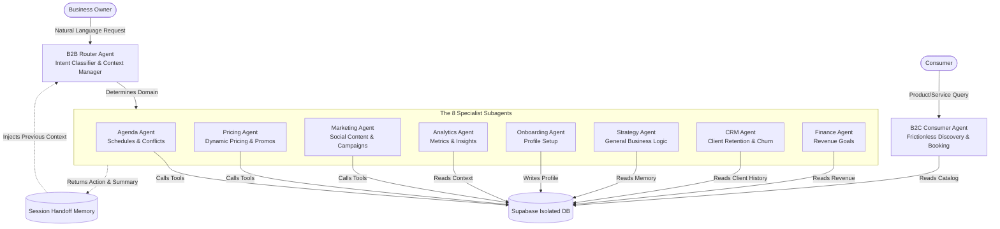

# Daily AI Core: Enterprise Vertical IAaaS & Agentic Commerce Engine

This repository contains the isolated **AI Core Logic** of **Daily**, a highly scalable, dedicated **Vertical AI SaaS (IAaaS)** platform. Powered by **Google Gemini 2.5 Flash** and **Supabase**, this architecture represents the state-of-the-art in Enterprise Agentic Systems.

---

## 🎯 The Vision: Democratizing AI Usage, Not Just Price

The true barrier to AI adoption in small and medium businesses isn't the subscription cost — it's the **cognitive load**. Business owners are not "Prompt Engineers". They don't have time to learn how to craft instructions, define system parameters, or chain LLM logic.

**Our Mission:** Democratize AI *Usage*.

With Daily, a business owner simply says: *"I want to run a 20% off haircut promotion this Friday."*

Behind the scenes, our **8-Subagent Architecture** automatically dissects this natural language intent, defines all necessary parameters, triggers the Marketing Agent to draft the post, triggers the Pricing Agent to apply the discount, and triggers the Agenda Agent to block out the slots. **Zero prompt engineering required from the user.** The AI acts as a fully autonomous digital operating system.

---

## 🏢 Business Model: Dedicated Enterprise IAaaS & Vertical Templates

Daily is **not** a generic multi-tenant chatbot where 10,000 businesses share the same database and risk exposing their sensitive data. Our architecture is designed for **High-Ticket B2B Enterprise & White-Label Franchising**.

We operate on a **Vertical AI Template** model:

1. **Industry-Specific Brains**: Pre-configured "Vertical Templates" (e.g., *Daily Health* for Clinics, *Daily Food* for Restaurants, *Daily Services* for Salons). Each template contains a highly specialized Database Schema, finely-tuned Agent Contexts, and proprietary Functions.
2. **Dedicated Instances (Single-Tenant Security)**: When a new client or franchise onboards, we clone the Vertical Template. They receive their own **100% isolated database** and a dedicated AI instance.
3. **White-Labeling**: The interface is customized to their brand.

This grants the **speed** of a generic SaaS with the **military-grade data security and extreme customization** of a dedicated Enterprise software.

---

## 🏛️ Ecosystem Overview: 8-Subagent Architecture

> **Note**: This is a read-only architectural showcase, decoupled from the main application. Files under `lib/ai/` that reference `@/lib/supabase` assume the Supabase client configuration from the main Daily repository and are not intended to run standalone here.

The AI ecosystem relies on a sophisticated **Router + 8 Specialists** paradigm. This drastically reduces token consumption, eliminates hallucination risks by isolating context, and provides highly specialized memory scopes per domain.



### 🧠 The 8 Specialist Agents

| # | Agent | Domain | Key Tools |
|---|-------|--------|-----------|
| 1 | **Agenda Agent** | Booking slots, cancellations, availability | `appointment.tools.ts` |
| 2 | **Pricing Agent** | Competitor analysis, dynamic discounts, service config | `pricing.tools.ts` |
| 3 | **Marketing Agent** | Instagram captions, WhatsApp broadcasts, content calendars | `content.tools.ts` |
| 4 | **Analytics Agent** | Engagement metrics, page views, storefront insights | `analytics.tools.ts` |
| 5 | **Onboarding Agent** | Missing profile detection, setup completion | — (context-driven) |
| 6 | **Strategy Agent** | Long-term planning, Q&A, general business advice | `memory.tools.ts` |
| 7 | **CRM Agent** | Client segments (Active, At Risk, Churned) | `crm.tools.ts` |
| 8 | **Finance Agent** | Revenue tracking, monthly targets | `finance.tools.ts` |

### 🛍️ Consumer AI (B2C)

The **Consumer Agent** is a separate AI pipeline designed for end-users:
- Natural language product/service discovery
- One-tap booking from chat
- Intent classification without LLM (local keyword parser for speed)
- Frictionless checkout flow integrated in the chat UI

---

## 📁 Repository Structure

```text
delta-ia-daily/
├── README.md
├── tsconfig.json
│
├── lib/
│   ├── ai/                              # 8-Subagent Core Logic
│   │   ├── router.ts                    # Intent classifier & routing orchestrator
│   │   ├── session-context.ts           # Handoff memory manager between turns
│   │   ├── types.ts                     # Type definitions for all agents
│   │   ├── index.ts                     # AI module exports
│   │   ├── agents/                      # The 8 Specialist Agents
│   │   │   ├── base.agent.ts            # Abstract base with shared logic
│   │   │   ├── agenda.agent.ts          # Booking & scheduling
│   │   │   ├── analytics.agent.ts       # Metrics & insights
│   │   │   ├── crm.agent.ts             # Client retention
│   │   │   ├── finance.agent.ts         # Revenue tracking
│   │   │   ├── marketing.agent.ts       # Content generation
│   │   │   ├── onboarding.agent.ts      # Profile setup
│   │   │   ├── pricing.agent.ts         # Dynamic pricing
│   │   │   └── strategy.agent.ts        # Business strategy
│   │   ├── contexts/                    # Isolated Context Builders (SQL data fetchers)
│   │   │   ├── shared-utils.ts          # Shared query utilities
│   │   │   ├── router.context.ts        # Router-level context
│   │   │   ├── agenda.context.ts        # Appointment data
│   │   │   ├── analytics.context.ts     # Metrics data
│   │   │   ├── crm.context.ts           # Client history
│   │   │   ├── finance.context.ts       # Revenue data
│   │   │   ├── marketing.context.ts     # Content data
│   │   │   ├── onboarding.context.ts    # Profile completeness
│   │   │   ├── pricing.context.ts       # Service pricing
│   │   │   └── strategy.context.ts      # Business data
│   │   ├── prompts/                     # Specialized system prompts per Agent
│   │   │   ├── agenda.prompt.ts
│   │   │   ├── analytics.prompt.ts
│   │   │   ├── crm.prompt.ts
│   │   │   ├── finance.prompt.ts
│   │   │   ├── marketing.prompt.ts
│   │   │   ├── onboarding.prompt.ts
│   │   │   ├── pricing.prompt.ts
│   │   │   └── strategy.prompt.ts
│   │   └── tools/                       # Isolated function tools (SQL mutations)
│   │       ├── analytics.tools.ts
│   │       ├── appointment.tools.ts     # Enhanced scheduling tools
│   │       ├── content.tools.ts
│   │       ├── crm.tools.ts
│   │       ├── finance.tools.ts
│   │       ├── memory.tools.ts
│   │       └── pricing.tools.ts
│   ├── ai.ts                            # Gemini LLM init & multi-agent config
│   ├── ai-tools.ts                      # Legacy monolithic tools (deprecated)
│   ├── intent-classifier.ts             # B2B local intent parser
│   └── supabase.ts                      # Supabase client config
│
├── hooks/                               # React Native frontend hooks
│   ├── use-ai-chat.ts                   # B2B Merchant Agent hook
│   ├── use-consumer-ai-chat.ts          # B2C Consumer Agent hook
│   ├── use-posts.ts                     # Post management hook
│   └── use-schedule.ts                  # Schedule management hook
│
├── ui-components/                       # Chat UI components
│   ├── ai-chat.tsx                      # B2B conversational interface
│   └── consumer-ai-chat/               # B2C discovery & booking interface
│
├── database-schema/                     # Supabase migrations & SQL
│   ├── init_ai_schema.sql               # Base schema: 3-layer memory, audit, RLS
│   ├── 20260517050000_ai_context_fields.sql  # Context memory fields
│   ├── 20260613_add_client_profile_link.sql  # Client-profile linking
│   ├── ai_logs_setup.sql                # AI observability & usage logs
│   ├── rpc_get_week_availability.sql    # Postgres function: weekly availability
│   ├── fix_missing_columns.sql          # Schema patches
│   ├── seed_demo_account.sql            # Demo data for hackathon judges
│   └── cleanup_demo.sql                 # Demo data cleanup
│
├── supabase/functions/                  # Supabase Edge Functions (active)
│   ├── gemini-chat/                     # Secure server-side LLM gateway
│   ├── daily-briefing/                  # Autonomous business analytics aggregator
│   ├── generate-image/                  # AI image generation
│   ├── gerar-texto-daily/               # AI text generation (PT-BR)
│   ├── inactivity-alert/                # Proactive engagement notifications
│   └── notify-booking/                  # Real-time transactional webhooks
│
├── supabase-edge-functions/             # Mirror (legacy deployment path)
│   ├── gemini-chat/
│   ├── daily-briefing/
│   ├── generate-image/
│   ├── gerar-texto-daily/
│   ├── inactivity-alert/
│   └── notify-booking/
│
└── docs/                                # Project documentation
    ├── architecture-diagram.html        # Interactive architecture visualization
    ├── business-vision.md               # Business model & vision document
    ├── unit-economics.md                # Unit economics & pricing analysis
    ├── roadmap.md                       # Development roadmap
    └── daily-future-vision.png          # Vision diagram
```

---

## ⚙️ Technical Highlights

### Router Intelligence
The `router.ts` classifies user intent across 8 domains using a combination of:
- **Local keyword parsing** (`intent-classifier.ts`) — zero latency, zero cost
- **LLM fallback** — only when local classification confidence is low
- **Session memory** (`session-context.ts`) — maintains conversation context across turns

### Agent Isolation
Each agent operates with:
- **Own system prompt** (`prompts/`) — persona-tuned for the domain
- **Own context builder** (`contexts/`) — fetches only the SQL data it needs
- **Own tool set** (`tools/`) — can only mutate its own domain tables

This ensures **zero cross-contamination** between agents and drastically reduces token consumption.

### Appointment System
The Agenda Agent uses `rpc_get_week_availability` — a Postgres function that computes available slots by cross-referencing:
- Professional's working hours
- Existing appointments
- Service duration
- Buffer time between appointments

### Edge Functions
| Function | Purpose | Trigger |
|----------|---------|---------|
| `gemini-chat` | Secure LLM gateway (API key never reaches client) | User message |
| `daily-briefing` | Aggregates daily business metrics autonomously | Cron / manual |
| `generate-image` | AI-powered image generation for marketing | Agent request |
| `gerar-texto-daily` | PT-BR text generation for social content | Agent request |
| `inactivity-alert` | Proactive push when user hasn't engaged | Cron |
| `notify-booking` | Real-time booking confirmations | Database webhook |

---

## 🔒 Security & Data Isolation

By fully decoupling the LLM context from generic multi-tenant logic, the Daily Architecture ensures **Zero-Data Leakage** between clients:

- Every function execution and context builder strictly filters by the instantiated professional ID (`seller_id`, `professional_id`)
- RLS (Row Level Security) enforced at the database level
- API keys never exposed to the client — all LLM calls routed through Edge Functions
- AI usage logs stored for auditability (`ai_logs_setup.sql`)

This makes the architecture robust enough to handle HIPAA-compliant health data or highly confidential enterprise financial data.

---

## 🚀 Quick Start (Judges)

This module is integrated as a **Git submodule** of the main [Daily](https://github.com/OmegaLabRJ/Daily) repository.

```bash
# Clone the main repo with submodules
git clone --recurse-submodules https://github.com/OmegaLabRJ/Daily.git

# Or if already cloned, init submodules
git submodule update --init --recursive
```

The AI chat is accessible from the main app via:
- **B2B**: Profile tab → AI Chat button (for merchants/professionals)
- **B2C**: Consumer AI chat (for end-users browsing products/services)

---

## 📄 Documentation

| Document | Description |
|----------|-------------|
| [Business Vision](docs/business-vision.md) | Full business model and market analysis |
| [Unit Economics](docs/unit-economics.md) | Pricing strategy and revenue projections |
| [Roadmap](docs/roadmap.md) | Development milestones and future plans |
| [Architecture Diagram](docs/architecture-diagram.html) | Interactive visualization of the system |

---

**Built with ❤️ by Ômega Lab RJ** — Rio de Janeiro, Brazil
