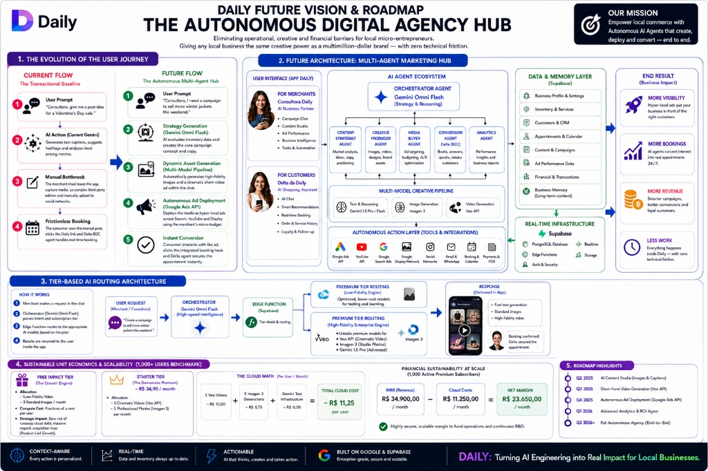
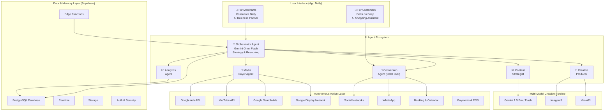

# Daily AI Core Architecture: Enterprise Dual-Agent System

This repository showcases the isolated **AI Core Logic** of **Daily**, an Agentic Commerce platform engineered to digitize local micro-retail and service-based businesses. Powered by **Google Gemini 2.5 Flash** and **Supabase**, the architecture moves beyond simple chatbot wrappers into a secure, deterministic, and transaction-safe multi-agent ecosystem.

---

## 🧠 Beyond the App: The Headless AI (IAaaS) Vision

While **Daily** is our flagship product and initial go-to-market application, our underlying architecture is fundamentally designed as a **Headless AI (AI-as-a-Service / IAaaS)** engine.

By isolating the conversational intelligence, intent classifiers, and deterministic function calling completely within backend **Supabase Edge Functions**, we have built a proprietary AI infrastructure rather than just an app feature.

**Daily** serves as our primary socio-digital validation—proving this engine's capability to orchestrate complex transactions for micro-entrepreneurs. However, this decoupled "Agent API" is fully scalable. In the future, this exact same infrastructure can be seamlessly white-labeled and plugged into the Creator Economy (automating DMs for influencers), B2B enterprise websites, or entirely new verticals (like real estate or healthcare) with minimal refactoring.

---

## 📁 Repository Structure

This showcase is explicitly decoupled from front-end layout configurations and styles to allow for strict technical auditing of our AI infrastructure:

```text
delta-ia-daily/
├── README.md                        # Enterprise Architecture Documentation
├── core-logic/
│   ├── ai.ts                        # Gemini LLM Initialization & Multi-Agent Configurations
│   ├── ai-tools.ts                  # Function Calling Schema Definitions & Core Implementations
│   └── intent-classifier.ts         # Multi-word Local Intent Parser (Latency & Cost Optimization)
├── database-schema/
│   └── init_ai_schema.sql           # PostgreSQL Schema: 3-Layer Memory, Audit Logs, and RLS
├── hooks/
│   ├── use-ai-chat.ts               # B2B Merchant Agent Logic ("Consultora Daily")
│   └── use-consumer-ai-chat.ts      # B2C Consumer Agent Logic ("Delta")
├── supabase-edge-functions/
│   ├── gemini-chat/                 # Secure Server-Side API Handshake & Token Management
│   ├── daily-briefing/              # Autonomous Business Analytics Aggregator
│   └── notify-booking/              # Real-Time Transactional Webhooks
└── ui-components/
    ├── ai-chat.tsx                   # B2B Conversational Interface Core
    └── consumer-ai-chat/            # B2C Frictionless Checkout & Booking Interface
```

---

## 🏛️ Ecosystem Overview: Dual-Agent Architecture

The AI ecosystem is divided into two distinct, highly specialized agents that interact with different user groups but share the same underlying platform infrastructure:

### 1. Consultora Daily (B2B Agent)

| Attribute | Detail |
|-----------|--------|
| **Target** | Beauty Professionals and Store Owners |
| **Role** | Business strategist, marketing manager, and operational assistant |
| **Capabilities** | Generates automated content calendars, creates SEO-optimized product descriptions with differentiated copy strategies, drafts social media posts with AI-generated image prompts, and tracks critical business metrics |
| **Long-term Memory** | Proactively asks for missing business data (one field at a time to minimize cognitive load) and stores long-term business facts for highly personalized advice |

### 2. Delta (B2C Agent)

| Attribute | Detail |
|-----------|--------|
| **Target** | End Consumers (Clients) |
| **Role** | Virtual receptionist and booking assistant representing the professional's store |
| **Capabilities** | Engages clients in natural conversation, answers questions about services, prices, and operating hours, and handles the complete booking flow autonomously |

---

## ⚙️ Technical Highlights

### 1. Cost-Optimized Intent Classification

To radically reduce latency and API costs, the system implements a **Local Intent Classifier** (`intent-classifier.ts`).
Before any LLM invocation, user input is evaluated against highly refined, multi-word Regex patterns.

- **Impact:** Common actions (e.g., checking the calendar, viewing metrics, adjusting settings) bypass the LLM entirely, instantly opening native app screens. This saves tokens, drops latency to zero for navigational commands, and prevents the LLM from hallucinating UI actions.

### 2. Deterministic Function Calling (Tool Use)

The AI interacts with the Supabase backend strictly through strongly-typed Function Calling defined in `ai-tools.ts`.

- **Type Safety:** Tools like `create_appointment`, `save_memory`, and `create_post_draft` enforce structured JSON schemas.
- **Graceful Fallbacks:** Replaced fragile string-matching (e.g., regexing `TAGS:`) with robust, schema-driven JSON parsing to guarantee deterministic outputs for critical operations like social media caption generation.
- **Secure Execution:** LLM API calls are executed securely inside Supabase Edge Functions (`gemini-chat`), hiding API keys and leveraging the backend's Row Level Security (RLS).

### 3. Anti-Double-Booking Logic

Delta's booking system handles the complex reality of calendar management:

- Validates requested slots against the professional's specific `schedules` configuration (working days, break times, slot duration).
- Performs real-time conflict validation against existing `appointments` immediately before insert, preventing race conditions.
- Seamlessly injects context (such as extracting the client's name from their profile and adding it to the appointment notes) so the professional's native Agenda view remains perfectly accurate.
- On successful booking, Delta autonomously generates a direct `wa.me` WhatsApp link, which the custom UI parser instantly converts into an actionable button for the client.

### 4. Context-Aware Memory & Injection

The system uses an advanced context builder that aggregates:

- The professional's profile data (bio, hours, location).
- Real-time catalog data (services and prices).
- Top-performing historical posts.
- Upcoming seasonal events (dynamically filtered for the next 30 days).
- Short-term conversational history.

This precise context injection allows the AI to operate at a lower temperature (`0.68`) for business-critical operations, drastically reducing hallucinations while maintaining a warm, empathetic persona.

---

## 🔄 User Journey Evolution: Current Baseline vs. Future Hub

To maximize user adoption among non-technical micro-entrepreneurs, our roadmap structurally minimizes human cognitive friction by shifting the operational workload entirely to background automated agents.

### 📉 Current Baseline Flow (High-Friction Manual Execution)

```
┌─────────────────────────────────────────────────────────────────┐
│  1. User Prompt (Human)                                         │
│     "Consultora, give me a post idea for a Valentine's Day      │
│      sale."                                                     │
│                          ▼                                      │
│  2. AI Action (Gemini)                                          │
│     Generates high-converting ad copy and suggests pricing      │
│     models.                                                     │
│                          ▼                                      │
│  3. ⚠️ Manual Bottleneck (Human)                                │
│     The merchant must copy the text, exit the app, use          │
│     third-party video software, and manually publish across     │
│     social networks.                                            │
│                          ▼                                      │
│  4. Frictionless Conversion (Background)                        │
│     The end-consumer clicks the bio link, and the Delta B2C     │
│     Agent handles real-time booking natively inside the app.    │
└─────────────────────────────────────────────────────────────────┘
```

### 🚀 Future Flow (Frictionless 2-Step Autonomous Hub)

```
┌─────────────────────────────────────────────────────────────────┐
│  1. Single Input Prompt (Human)                                 │
│     "Consultora, I need a campaign to sell more winter jackets  │
│      this weekend."                                             │
│                          ▼                                      │
│  2. Autonomous Execution Pipeline (Background Agents)           │
│     • Gemini Omni Flash evaluates real-time inventory metrics   │
│       and designs the campaign copy.                            │
│     • Vertex AI Media APIs automatically synthesize             │
│       professional studio imagery and cinematic short-form      │
│       promotional videos.                                       │
│                          ▼                                      │
│  3. One-Click Approval (Human)                                  │
│     The merchant reviews the pre-generated visual and textual   │
│     assets inside the chat interface and clicks                 │
│     "Approve & Deploy".                                         │
│                          ▼                                      │
│  4. Autonomous Distribution (Background Pipeline)               │
│     The platform handles deployment to Google Search, YouTube,  │
│     and Display Networks, securing immediate transactional      │
│     bookings via the Delta Agent.                               │
└─────────────────────────────────────────────────────────────────┘
```

---

## 🗺️ Daily Future Vision: The Autonomous Digital Agency Hub

> *Eliminating operational, creative, and financial barriers for local micro-entrepreneurs. Giving any local business the same creative power as a multimillion-dollar brand — with zero technical friction.*



### Future Architecture: Multi-Agent Marketing Hub

The vision evolves from a dual-agent transactional engine into a fully autonomous marketing hub with specialized sub-agents:



### End Result: Business Impact

| Metric | Outcome |
|--------|---------|
| **More Visibility** | Hyper-local ads put your business in front of the right customers |
| **More Bookings** | AI agents convert interest into real appointments 24/7 |
| **More Revenue** | Smarter campaigns, better conversions, loyal customers |
| **Less Work** | Everything happens inside Daily — with zero technical friction |

---

## ⚙️ Tier-Based AI Routing Architecture

To scale seamlessly to thousands of concurrent users without creating an unsustainable cloud compute burn rate, the system utilizes a server-side **Tier-Based AI Routing Pipeline**:

```
  ┌──────────────────┐
  │   USER REQUEST    │
  │ (Merchant / Chat) │
  └────────┬─────────┘
           ▼
  ┌──────────────────────────┐
  │   ORCHESTRATOR           │
  │   Gemini Omni Flash      │
  │   (High-Speed Intel)     │
  └────────┬─────────────────┘
           ▼
  ┌──────────────────────────┐
  │   EDGE FUNCTION          │
  │   (Supabase)             │
  │   Tier Check & Routing   │
  └────┬─────────────┬───────┘
       ▼             ▼
┌──────────────┐ ┌───────────────────────┐
│  FREEMIUM    │ │  PREMIUM TIER         │
│  TIER        │ │  (High-Fidelity       │
│  (Low-Fi)    │ │   Enterprise Engine)  │
│              │ │                       │
│  Optimized,  │ │  • Veo API (Cinematic │
│  lower-cost  │ │    Video)             │
│  open-source │ │  • Imagen 3 (Studio   │
│  models      │ │    Photos)            │
│              │ │  • Gemini 1.5 Pro     │
│              │ │    (Advanced)         │
└──────────────┘ └───────────────────────┘
```

- **The Orchestrator (Gemini Omni Flash):** Intercepts the user request, checks the merchant's subscription status via PostgreSQL, and dynamically routes the media engineering payload.
- **Freemium Tier Routing (Low-Fidelity Engine):** Free users are routed to highly optimized, lower-fidelity open-source models for basic imagery. This satisfies the "test drive" concept at near-zero token cost.
- **Premium Tier Routing (High-Fidelity Enterprise Engine):** Premium subscriptions unlock access to flagship creative models—**Imagen 3** (for professional studio photography) and **Google Veo API** (pending enterprise private preview access)—delivering unmatched, professional aesthetic results.

---

## 📊 Sustainable Unit Economics & Scalability (1,000+ Users Benchmark)

By replacing volatile "per-day" allowances with a **Monthly Tokenized Quota Model**, our unit economics scale securely while maintaining strong net margins.

### 1. Free Impact Tier (The Product-Led Growth Engine)

| Parameter | Value |
|-----------|-------|
| **Allocation** | 1 Low-Fidelity Video + 3 Standard Images per month |
| **Compute Cost** | Fractions of a cent per user |
| **Strategic Growth** | Operates as an organic acquisition funnel; users convert to paid tiers once they track clear financial ROI from their initial free campaigns |

### 2. Starter Tier (The Democratic Premium)

| Parameter | Value |
|-----------|-------|
| **Target Price Point** | ~R$ 34.90 / month |
| **Monthly Allocation** | 2 Cinematic Videos + 5 Professional Studio Photos |

#### Projected Unit Economics (Per User / Month)

| Cost Component | Value |
|----------------|-------|
| 2 Cinematic Video Generations (Vertex AI) | ~R$ 10.00 |
| 5 Imagen 3 Studio Asset Generations | ~R$ 0.75 |
| Gemini Omni Text & Core Infrastructure | ~R$ 0.50 |
| **Total Projected Cloud Cost** | **R$ 11.25 / user / month** |

#### Financial Sustainability at Scale (1,000 Active Premium Subscribers)

```
  ┌────────────────────────────────────────────────────────┐
  │                   THE CLOUD MATH                       │
  │                                                        │
  │   2 Veo Videos    5 Imagen 3    Gemini Text            │
  │   ~R$ 10.00    +  ~R$ 0.75   +  ~R$ 0.50              │
  │                                                        │
  │          = R$ 11.25 per user / month                   │
  ├────────────────────────────────────────────────────────┤
  │                                                        │
  │   MRR (Revenue)        Cloud Costs      NET MARGIN     │
  │   R$ 34,900.00    -   R$ 11,250.00   = R$ 23,650.00   │
  │      /month              /month           /month       │
  │                                                        │
  │   ✅ Highly secure, scalable margin to fund            │
  │      operations and continuous R&D.                    │
  └────────────────────────────────────────────────────────┘
```

---

## 🗺️ Strategic Implementation Roadmap

To maintain engineering credibility and account for compliance barriers, our multi-agent deployment is divided into rigorous, high-velocity phases:

```mermaid
gantt
    title Daily Strategic Roadmap
    dateFormat  YYYY-QQ
    axisFormat  %Y-Q%q

    section Foundation
    Dual-Agent Transactional Engine           :done, 2026-Q2, 90d
    Context-Aware Memory & Intent Classifier  :done, 2026-Q2, 90d
    Anti-Double-Booking Sync (Supabase)       :done, 2026-Q2, 90d

    section Multimodal Studio
    Imagen 3 API Integration (Vertex AI)      :active, 2026-Q3, 90d
    Freemium / Premium Tier Routing           :active, 2026-Q3, 90d

    section Video Generation
    Google Veo API Integration (upon GA)      : 2026-Q4, 90d
    Cinematic Production in Chat              : 2026-Q4, 90d

    section Enterprise Traffic
    Google Ads API & Performance Max          : 2027-Q1, 90d
    Developer Token Compliance               : 2027-Q1, 90d
    Automated Ad Policy Checks               : 2027-Q1, 90d
```

| Phase | Timeline | Milestones |
|-------|----------|------------|
| **Baseline** | Q2 2026 *(Current)* | Production-ready dual-agent transactional engine. Complete implementation of context-aware memory, local intent classification, and real-time anti-double-booking synchronization via Supabase. |
| **Multimodal Content Studio** | Q3 2026 | Direct integration with the **Imagen 3 API** via Vertex AI for high-fidelity product background transformations. Launch of the Freemium/Premium tier routing system. |
| **Cinematic Video Generation** | Q4 2026 | Integration with the **Google Veo API** upon General Availability (GA), transitioning from fallback video models to native cinematic production inside the chat. |
| **Enterprise Traffic Integration** | Q1 2027 | Implementation of the **Google Ads API & Performance Max** infrastructure. Includes dedicated onboarding flows for developer token compliance, merchant billing verification, and automated ad policy checks. |

---

## 🏗️ Built With

| Technology | Purpose |
|------------|---------|
| **Google Gemini 2.5 Flash** | Core LLM for reasoning, strategy, and conversation |
| **Supabase** | PostgreSQL database, Edge Functions, Auth, Realtime, and Storage |
| **React Native / Expo** | Cross-platform mobile application framework |
| **TypeScript** | End-to-end type safety across the entire stack |
| **Vertex AI** | Media generation pipeline (Imagen 3, Veo API) |
| **Google Ads API** | Autonomous ad distribution (roadmap) |

---

<p align="center">
  <strong>DAILY: Turning AI Engineering into Real Impact for Local Businesses.</strong>
</p>
