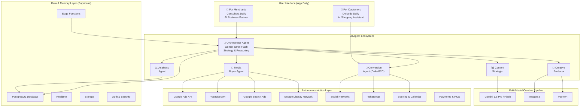

# 🧠 Daily: Headless AI (IAaaS) Vision & Business Model

## Beyond the App: The Headless AI Vision

While **Daily** is our flagship product and initial go-to-market application, our underlying architecture is fundamentally designed as a **Headless AI (AI-as-a-Service / IAaaS)** engine.

By isolating the conversational intelligence, intent classifiers, and deterministic function calling completely within backend **Supabase Edge Functions**, we have built a proprietary AI infrastructure rather than just an app feature.

**Daily** serves as our primary socio-digital validation—proving this engine's capability to orchestrate complex transactions for micro-entrepreneurs. However, this decoupled "Agent API" is fully scalable. In the future, this exact same infrastructure can be seamlessly white-labeled and plugged into the Creator Economy (automating DMs for influencers), B2B enterprise websites, or entirely new verticals (like real estate or healthcare) with minimal refactoring.

---

## 🔄 User Journey Evolution: Current Baseline vs. Future Hub

To maximize user adoption among non-technical micro-entrepreneurs, our roadmap structurally minimizes human cognitive friction by shifting the operational workload entirely to background automated agents.

### 📉 Current Baseline Flow (High-Friction Manual Execution)

```text
┌─────────────────────────────────────────────────────────────────┐
│  1. User Prompt (Human)                                         │
│     "Consultora, give me a post idea for a Valentine's Day      │
│      sale."                                                     │
│                          ▼                                      │
│  2. AI Action (Gemini)                                          │
│     Generates high-converting ad copy and suggests pricing      │
│     models.                                                     │
│                          ▼                                      │
│  3. ⚠️ Manual Bottleneck (Human)                                │
│     The merchant must copy the text, exit the app, use          │
│     third-party video software, and manually publish across     │
│     social networks.                                            │
│                          ▼                                      │
│  4. Frictionless Conversion (Background)                        │
│     The end-consumer clicks the bio link, and the Delta B2C     │
│     Agent handles real-time booking natively inside the app.    │
└─────────────────────────────────────────────────────────────────┘
```

### 🚀 Future Flow (Frictionless 2-Step Autonomous Hub)

```text
┌─────────────────────────────────────────────────────────────────┐
│  1. Single Input Prompt (Human)                                 │
│     "Consultora, I need a campaign to sell more winter jackets  │
│      this weekend."                                             │
│                          ▼                                      │
│  2. Autonomous Execution Pipeline (Background Agents)           │
│     • Gemini Omni Flash evaluates real-time inventory metrics   │
│       and designs the campaign copy.                            │
│     • Vertex AI Media APIs automatically synthesize             │
│       professional studio imagery and cinematic short-form      │
│       promotional videos.                                       │
│                          ▼                                      │
│  3. One-Click Approval (Human)                                  │
│     The merchant reviews the pre-generated visual and textual   │
│     assets inside the chat interface and clicks                 │
│     "Approve & Deploy".                                         │
│                          ▼                                      │
│  4. Autonomous Distribution (Background Pipeline)               │
│     The platform handles deployment to Google Search, YouTube,  │
│     and Display Networks, securing immediate transactional      │
│     bookings via the Delta Agent.                               │
└─────────────────────────────────────────────────────────────────┘
```

---

## 🗺️ Daily Future Vision: The Autonomous Digital Agency Hub

> *Eliminating operational, creative, and financial barriers for local micro-entrepreneurs. Giving any local business the same creative power as a multimillion-dollar brand — with zero technical friction.*


### Future Architecture: Multi-Agent Marketing Hub

The vision evolves from a dual-agent transactional engine into a fully autonomous marketing hub with specialized sub-agents:



### End Result: Business Impact

| Metric | Outcome |
|--------|---------|
| **More Visibility** | Hyper-local ads put your business in front of the right customers |
| **More Bookings** | AI agents convert interest into real appointments 24/7 |
| **More Revenue** | Smarter campaigns, better conversions, loyal customers |
| **Less Work** | Everything happens inside Daily — with zero technical friction |
